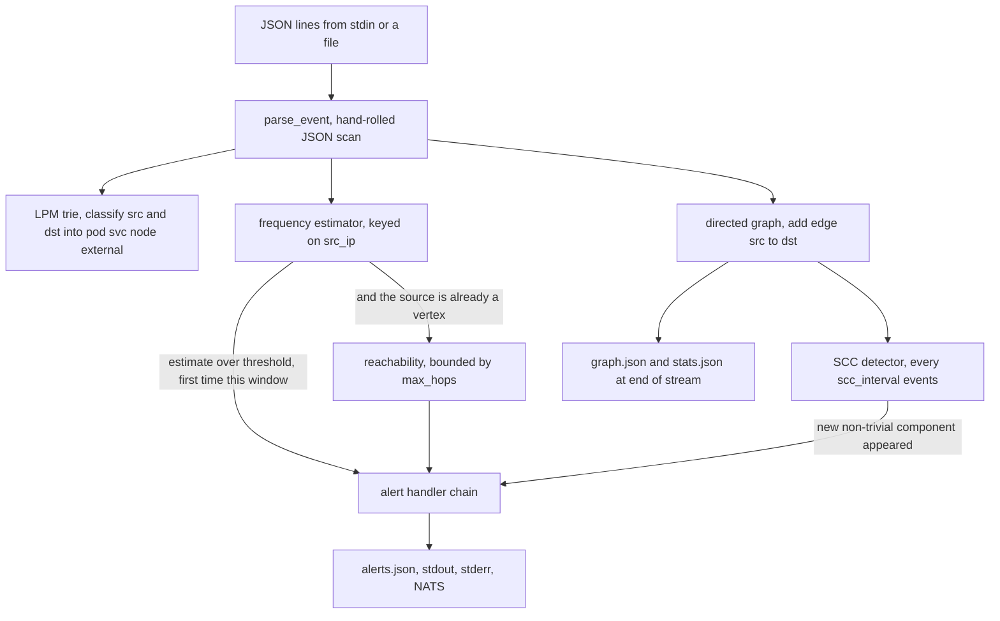

# K8sSecDaP-pipeline

The detection engine for [K8sSecDaP](https://github.com/john-naeder/K8sSecDaP), plus the
data-structure library it is built on. C++17, no external dependencies beyond the standard
library.

`zt-pipeline` reads a stream of network-connection events — one JSON object per line, from a
file or from stdin, produced by the eBPF collector — and turns it into alerts. It answers
three questions at once, each with a different algorithm and a different memory profile:

- **Is one source opening too many connections?** Frequency estimation over a sliding window.
  Over threshold means port scan.
- **Are there cycles in the service call graph?** Strongly connected components on the
  who-talked-to-whom graph. A cycle in a layered architecture is either a design violation or
  lateral movement.
- **If this host is compromised, what else can it reach?** Bounded breadth-first search from
  the offending node. Blast radius.

## Event flow



The window is tumbling, not sliding: when an event arrives more than `window_seconds` after
the window start, the estimator is reset wholesale and the set of already-alerted sources is
cleared. That is the cheapest thing that works and it has a known cost — see Limits.

## Swapping algorithms without recompiling

Every stage is an interface with more than one implementation, registered by name in a
generic factory (`libdsa/include/dsa/registry.h`, `libdsa/src/registry.cpp`) and selected from
YAML at startup:

| Stage | Interface | Registered names |
|---|---|---|
| Frequency | `dsa::frequency::Estimator` | `count_min_sketch`, `hash_map_exact`, `heavy_hitters` |
| SCC | `dsa::graph::SCCDetector` | `tarjan`, `kosaraju` |
| Reachability | `dsa::graph::ReachabilityAnalyzer` | `bfs`, `dijkstra` |
| IP classification | `dsa::trie::IPClassifier` | `lpm_trie` |
| Alert output | `dsa::soc::AlertHandler` | `file`, `stdout`, `stderr`, `nats` |

This was built to make the thesis comparison honest — the same binary on the same stream, one
config line apart — but it is also what makes the alert output configurable, because handlers
fan out through the same registry. Every alert goes to every handler in order and one handler
failing does not stop the others.

## The frequency benchmark, and what it actually shows

`heavy_hitters` is Misra-Gries: at most `k-1` counters, guaranteed underestimate, error bounded
by `m/k` over a stream of length `m`. `count_min_sketch` is a `width × depth` counter table with
`depth` hash functions, guaranteed overestimate. `hash_map_exact` is an `unordered_map` and is
exact. All three implement the same interface.

The numbers below are committed in the umbrella repo under `output/`; read them there rather
than trusting this table.

Synthetic microbenchmark, `output/bench/throughput.csv` — a tight loop of `record` calls:

| | ops/sec | memory |
|---|---|---|
| CMS, width 2048, depth 5 | 13.2 M | 80 KB |
| CMS, width 512 | 13.6 M | 20 KB |
| exact hash map | 7.1 M | 3808 KB |

Realistic port-scan trace, 200 events, `output/portscan/comparison.csv`:

| | alerts | true pos | false pos | peak memory | throughput |
|---|---|---|---|---|---|
| CMS | 1 | 1 | 0 | 80.0 KB | 208 k eps |
| Misra-Gries | 1 | 1 | 0 | 0.42 KB | 167 k eps |
| exact hash map | 1 | 1 | 0 | 0.40 KB | 219 k eps |

**The sketch loses on the realistic trace.** It is fastest and smallest in the microbenchmark
because that benchmark pushes millions of distinct keys through, which is where a fixed-size
table beats a growing hash map. A real node sees tens to hundreds of distinct source IPs, and
at that cardinality the exact map is both faster and two orders of magnitude smaller — the
sketch is paying for 2048 × 5 counters to track 200 keys. Misra-Gries lands in between: the
smallest of the three at this scale but slower, because every miss on a full counter set
decrements every counter.

The sketch stays the default because the thesis is about streaming algorithms and because the
argument for it is asymptotic: memory independent of key cardinality is what you want on a
node where the source-IP set is not bounded by anything you control. On the traces actually
measured here, that argument has not yet paid for itself, and saying otherwise would be
dishonest.

Error against theory, `output/bench/error_rate.csv`, average overcount per key by table width:

| width | theoretical epsilon | avg overcount |
|---|---|---|
| 256 | 0.01062 | 368.3 |
| 1024 | 0.00265 | 86.2 |
| 4096 | 0.00066 | 18.8 |

Halving the error by doubling the width, as advertised.

## Layout

```
pipeline/src/engine.cpp          the event loop, alert construction, output
pipeline/src/config_loader.cpp   a small YAML reader for the config file
libdsa/include/dsa/              the interfaces: estimator.h, scc_detector.h, reachability.h,
                                 ip_classifier.h, alert_handler.h, registry.h
libdsa/src/frequency/            count_min_sketch, heavy_hitters (Misra-Gries), hash_map_exact
libdsa/src/graph/                directed_graph, tarjan, kosaraju, bfs, dijkstra
libdsa/src/trie/                 lpm_trie
libdsa/src/soc/                  Alert, the handler chain, and the file/stdout/stderr/nats sinks
libdsa/tests/                    12 test files, one per component
libdsa/benchmarks/               the four benchmarks that produce the CSVs above
```

## Build

```bash
cmake -S . -B build && cmake --build build -j
./build/pipeline/zt-pipeline --help
./build/pipeline/zt-pipeline --config config/pipeline.yaml
```

Tests and benchmarks are opt-in:

```bash
cmake -S . -B build -DBUILD_TESTS=ON -DBUILD_BENCHMARKS=ON
cmake --build build -j && ctest --test-dir build
```

`BUILD_SOC_NATS=ON` links against `libnats` for real NATS publishing. It is off by default,
and with it off the `nats` handler logs to stderr with a `[nats-stub]` prefix rather than
failing — in the cluster the `alert-bridge` sidecar does the publishing instead, which keeps
`libnats` out of this binary entirely.

The container image is built from the umbrella repo (`Dockerfile.pipeline`), not here: it
needs `tools/`, `scripts/`, `config/` and the entrypoints from `soc/` alongside the engine.

## Limits

- **The JSON parser is a substring search.** `json_string_value` in `engine.cpp` finds
  `"key"`, skips to the value and reads to the next delimiter. It is fast and has no
  dependencies, and it will happily mis-parse any nested object, escaped quote or reordered
  key. It is correct only for the exact line format the collector emits.
- **The tumbling window is the source of both known detection failures.** A scan held under
  the threshold within each window is never seen; a chatty benign client that crosses it once
  is flagged. A sliding window keyed on distinct destination ports fixes both and is not done.
- **SCC runs every `scc_interval_seconds * 10` events**, not on a timer. On a slow stream it
  effectively never runs; on a fast one it runs constantly. The comment in the source admits
  this is an approximation of the intended behaviour.
- **The graph never forgets.** Vertices and edges accumulate for the process lifetime, so
  memory grows with the number of distinct IP pairs ever seen and the SCC pass gets slower
  over time. There is no eviction.
- **Single-threaded**, one event at a time, no back-pressure signalling to the collector.
- **`engine.cpp` falls back to a hardcoded absolute path** when searching for the config file.
  Harmless, but it is a leftover from an earlier machine and should be deleted.
